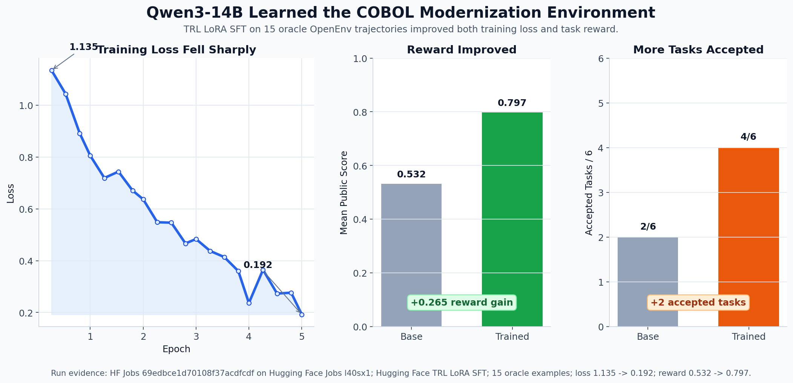
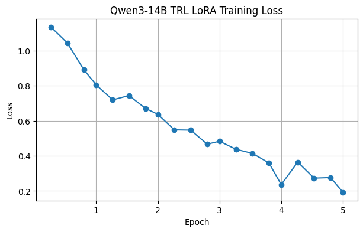
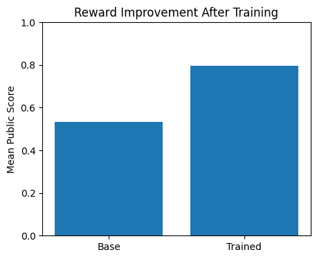
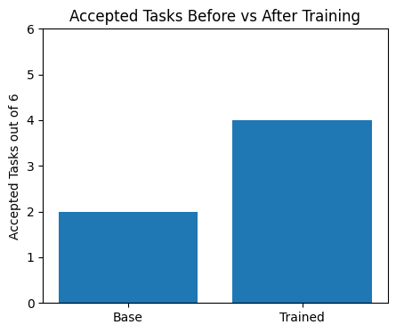

# Legacy COBOL Migration Workbench

Legacy COBOL Migration Workbench is an OpenEnv environment for training an LLM to act like a legacy modernization engineer. The agent receives a migration ticket, inspects COBOL programs and copybooks through tools, writes Python, runs visible tests, studies structured diffs, repairs its draft, and submits code scored on hidden and fresh tests.

The target capability is not one-shot translation. Real modernization depends on fixed-width records, copybooks, implied decimals, `OCCURS` tables, level-88 condition names, branch precedence, and exact output formatting. This environment turns that workflow into a partially observable, tool-mediated training loop.

## Submission Materials

- Mini-blog: [`blog.md`](blog.md)
- Hugging Face Space: <https://huggingface.co/spaces/Ishangtxl/mainframe-modernization-openenv>
- Training run notebook: <https://colab.research.google.com/drive/1XGcw8Xkcyx1byYqSu5jpF9UWPIQWWBCi?usp=sharing>
- Training evidence: [`outputs/training/sft_run_metadata.json`](outputs/training/sft_run_metadata.json)
- Training log: [`outputs/training/hf_job_qwen3_14b_logs.txt`](outputs/training/hf_job_qwen3_14b_logs.txt)
- Score summary: [`outputs/evals/score_summary.json`](outputs/evals/score_summary.json)

## Environment

Each episode starts with a partial ticket. The agent can discover details through MCP tools:

- `read_cobol_file`
- `read_copybook`
- `parse_copybook_layout`
- `inspect_business_rules`
- `write_python_solution`
- `run_visible_tests`
- `inspect_diff`
- `submit_final`

The submitted Python code must define:

```python
def migrate(input_record: str) -> str:
    ...
```

Episodes are capped at 24 tool steps. Visible tests are available for debugging, but hidden and fresh cases are withheld until final scoring.

## Reward

```text
final_reward =
  0.55 * hidden_correctness
+ 0.15 * fresh_correctness
+ 0.10 * interface_contract
+ 0.08 * type_and_layout_fidelity
+ 0.07 * anti_hardcoding
+ 0.05 * safety
```

The reward is correctness-heavy, but it also penalizes unsafe code, broken interfaces, layout drift, and visible-case hardcoding.

## Task Families

| Task | Difficulty | COBOL concepts | Main failure modes |
| --- | --- | --- | --- |
| `fixed_width_customer` | easy | `PIC X`, padding/truncation, status mapping | trimmed spaces, lost ZIP leading zeros, bad output width |
| `decimal_copybook_payroll` | medium | copybook layout, implied decimals, level-88 bonus flag | float drift, wrong rounding, wrong fixed-width net pay |
| `claims_eligibility_branching` | medium | `EVALUATE TRUE`, branch precedence | wrong first-match branch, boundary mistakes |
| `account_status_level88` | medium | level-88 status conditions, signed amount | treating condition names as variables, wrong precedence |
| `date_normalization` | medium | legacy YYMMDD windowing, validation | wrong century window, over-rejecting legacy dates |
| `invoice_occurs_totals` | hard | multi-file `INVTOTAL.cbl`/`TAXRATE.cbl`, `OCCURS`, copybook tax-code metadata | wrong stride, ignoring tax-code lookup, overfitting visible invoice IDs |

`inspect_business_rules` exposes agent-facing hints only. Exact reference behavior stays internal to hidden and fresh tests.

## Results

The current training run uses Hugging Face TRL LoRA SFT on `Qwen/Qwen3-14B` with 15 oracle and repair examples. Evaluation uses the same OpenEnv rollout harness before and after training.

| Policy | Role | Mean public score | Accepted tasks |
| --- | --- | ---: | ---: |
| deterministic identity | deterministic baseline | 0.1500 | 0 / 6 |
| deterministic blank width | deterministic baseline | 0.1767 | 0 / 6 |
| base `Qwen/Qwen3-14B` | model before SFT | 0.5320 | 2 / 6 |
| trained `Qwen/Qwen3-14B` LoRA SFT | model after SFT | 0.7971 | 4 / 6 |
| `oracle-model` | sanity check with reference solutions | 1.0000 | 6 / 6 |



This dashboard summarizes the before/after reward evidence for the Qwen3-14B LoRA SFT run.



The SFT run reduced loss from `1.1350` to `0.1924` and improved mean token accuracy from `0.7938` to `0.9483`.



The trained checkpoint improved mean public reward from `0.5320` to `0.7971`.



Accepted tasks improved from `2 / 6` to `4 / 6`.

## Training Artifacts

Kept in the submission root:

- `outputs/training/sft_run_metadata.json`: completed-run metadata for the Qwen3-14B LoRA SFT run
- `outputs/training/sft_loss.csv`: real training loss and token-accuracy history
- `outputs/training/qwen3_14b_training_evidence_summary.json`: compact extracted training/eval summary
- `outputs/training/hf_job_qwen3_14b_logs.txt`: raw HF Jobs log for provenance
- `outputs/evals/base_qwen3_14b_all_tasks.json`: before-training rollout
- `outputs/evals/score_summary.json`: judge-facing summary with deterministic, base-model, trained-model, and oracle rows
- `plots/qwen3_14b_training_reward_evidence_dashboard.png`
- `plots/qwen3_14b_loss_curve.png`
- `plots/qwen3_14b_reward_before_after.png`
- `plots/qwen3_14b_accepted_before_after.png`

The old dry-run `sft_loss.svg` scaffold is intentionally not included as judge-facing training evidence.

## Historical Artifacts

Older Azure `gpt-5.4-mini` rollouts are archived under `outputs/evals/historical/`. They were produced before the invoice task was hardened into a multi-file tax-code task, so they are preserved for context but excluded from the current score summary.

## Run Locally

```bash
python -m venv .venv
.venv/bin/pip install -e ".[dev]"
PYTHONDONTWRITEBYTECODE=1 PYTHONPATH=. .venv/bin/pytest tests -q -p no:cacheprovider
```

Run the server:

```bash
PYTHONPATH=. .venv/bin/python -m uvicorn legacy_cobol_env.server.app:app --host 127.0.0.1 --port 8000
curl -sS http://127.0.0.1:8000/health
curl -sS http://127.0.0.1:8000/schema
```

Validate the OpenEnv package:

```bash
.venv/bin/openenv validate --verbose
```

Regenerate the score summary:

```bash
.venv/bin/python -m legacy_cobol_env.eval.run_evidence_report
```

Run the root inference script:

```bash
API_BASE_URL="https://..." MODEL_NAME="..." HF_TOKEN="..." .venv/bin/python inference.py --max-repairs 1
```

The inference script emits `[START]`, one `[STEP]` per task, and `[END]`.

## Safety Note

Candidate code is checked for common unsafe imports and builtins, executed in a temporary subprocess with cleared environment variables, and bounded by a timeout. This is layered mitigation for a hackathon environment, not a complete secure sandbox.
